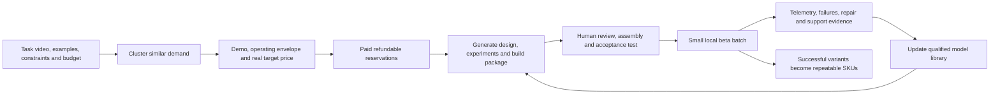
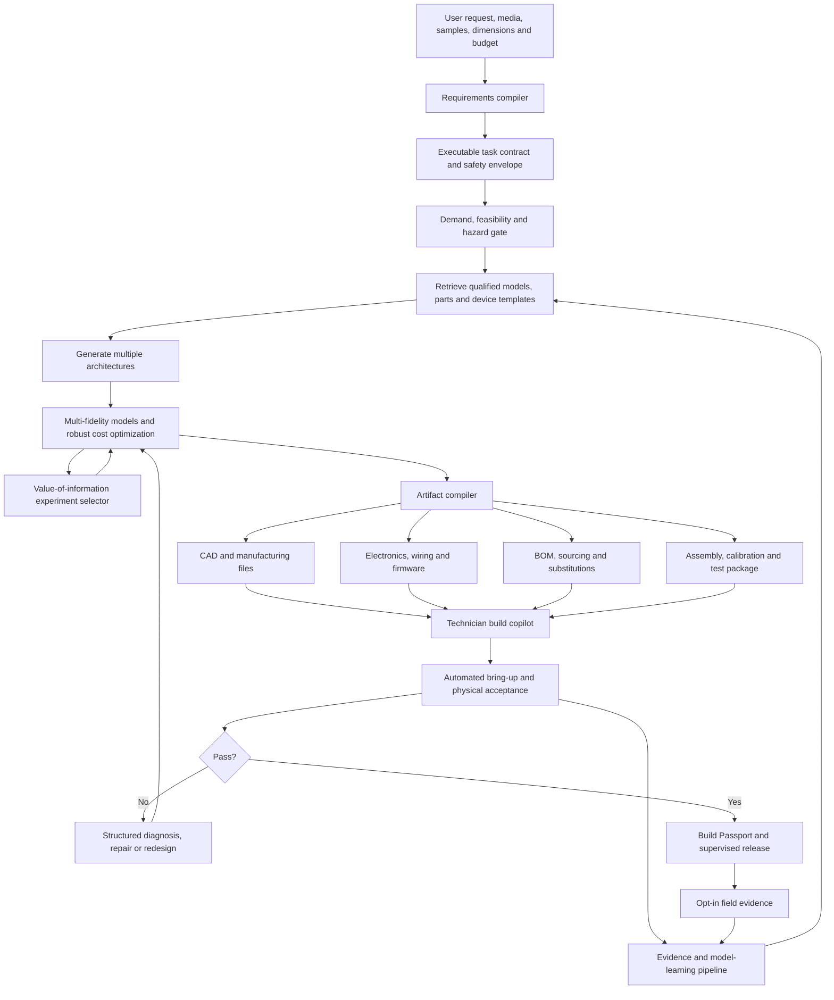

# Implementation plan v2: consumer engineering harness

Prepared 2026-08-01. This plan replaces the initial enterprise-first implementation sequence for the current strategy. It retains the technical foundation of the [original plan](./04_implementation_plan.md), the [probabilistic-framework assessment](./02_probabilistic_frameworks.md), and the [catalog corpus](./03_catalog_corpus.md), but changes the product, benchmark, economics and order of operations.

## Executive recommendation

Build a **micro-appliance foundry powered by an internal autonomous engineering harness**.

The customer does not buy a model, simulator or CAD assistant. They submit a bounded physical chore, examples of the real environment and a budget; the company returns a tested, repairable device with a clear operating envelope. Humans initially perform assembly, inspection and release. The system should progressively own requirements, architecture, component choice, CAD, electronics, firmware, simulation, experiment design, documentation, calibration and diagnosis.

The first proof should be a guarded tabletop trading-card workstation family, not a universal robot and not merely a card sorter. Build at least two related variants:

- **Device A:** feed, scan, catalog, uncertainty-aware reject and configurable sort for one frozen card format.
- **Device B:** a held-out generated adaptation whose primary target is reliable sleeving; a materially different card/sleeve/bin configuration is pre-registered as the fallback, not chosen after seeing Device A.

The pilot succeeds only if the second build is substantially faster and cheaper because it reuses qualified models, modules, tests and evidence. One impressive prototype is not sufficient.

## 1. Pre-register the actual hypotheses

### Company hypothesis

> Validated engineering knowledge can be amortized across families of small, customized devices, making previously uneconomic physical products profitable without sacrificing bounded, measurable reliability.

### What the pilot must and must not establish

It must establish that the system can:

1. Convert a nonexpert request into an executable task contract.
2. Generate a buildable multidisciplinary design with limited expert authorship.
3. Guide a technician through assembly and bring-up.
4. Predict meaningful physical outcomes with calibrated uncertainty.
5. Meet a pre-registered physical acceptance suite.
6. Make a held-out related variant materially cheaper and faster through reuse.
7. Find customers willing to pay a price that covers the full marginal cost.

It does **not** need to establish universal invention, expert-level performance in every domain, safety certification through Bayesian inference, autonomous manufacturing, or superiority to a polished mass-market product.

### Falsifiable hypotheses and gates

| Hypothesis | Pilot measurement | Initial pass gate |
|---|---|---|
| H1: mostly autonomous engineering | Expert interventions and artifact-level edits on a held-out variant | At least 80% of weighted design artifacts accepted without material expert modification under the definition in Section 5; no more than 4 expert-hours |
| H2: first-build usefulness | Total elapsed time, procurement time, hardware iterations and acceptance results | Held-out variant functions within 21 calendar days of the frozen brief, within 7 days after all planned parts arrive, and needs no more than one physical redesign |
| H3: library compounds | Frozen weighted exact-hash dependency reuse, expert hours and calibration experiments across A and B | At least 70% weighted reuse under Section 5; at least 50% fewer expert hours and 30% fewer physical calibration trials on B |
| H4: uncertainty is decision-useful | Frozen pre-data predictions versus independent units/lots/input groups; selected experiments | Proper scores beat a point/base-rate baseline on the decision-critical outcomes and at least one value-of-information experiment changes a consequential decision; coverage/PIT with sampling uncertainty becomes a longitudinal score, not a claim of broad calibration from a few builds |
| H5: consumer economics exist | Paid demand, fully loaded family economics and task-appropriate repeat use | Positive projected family contribution within a pre-registered payback horizon, with required break-even units no greater than the qualified addressable demand |
| H6: the harness has a real cost advantage | Same frozen brief completed by an experienced-maker baseline using the same available modules and fabrication access | At least 3× fewer expert engineering hours **and** lower fully loaded nonrecurring cost at comparable acceptance performance; otherwise reject the initial cost-advantage claim |

Freeze the scoring rules, baselines and allowed human roles before evaluating the pilot. Record failures and intervention time automatically; do not reconstruct them from memory.

## 2. Product form and operating model

The initial product is a service with software leverage, not self-service CAD:



This operating model prevents three common traps:

- **unbounded one-offs:** requests are clustered into a device family before engineering;
- **false autonomy:** humans may assemble and release, but every design intervention is measured;
- **prototype theater:** the delivered device must pass a physical contract and survive beta use.

### Bounded customization policy

| Class | Permitted change | Evidence treatment | Customer access |
|---|---|---|---|
| A: configuration | software settings, sorting policy, thresholds, labels inside a prequalified parameter envelope | Inherits applicable qualification; automated regression and commissioning | Directly configurable |
| B: bounded variant | approved passive geometry, dimensions, bin arrangement or module inside a validated envelope | Change-impact analysis plus generated delta tests | Guided configuration |
| C: new SKU | new power, actuator, hazard, material, chemistry, architecture or operating environment | Human review and full requalification | Submitted for family review, not instant purchase |

Most early customer value should come from A and B. If most demand requires C, the business will behave like a conventional consultancy.

### Consumer-facing output

The consumer should receive the device and a **Build Passport**, not a probabilistic-programming report. It should state:

- supported inputs, dimensions and environment;
- measured throughput and error rates;
- endurance and fault tests actually run;
- known exclusions and abstention behavior;
- safe loading, cleaning and jam-clearing procedures;
- maintenance and replaceable modules;
- exact device version and meaningful substitutions;
- a clear statement that internal qualification is not regulatory certification.

## 3. Select the first device family deliberately

### Selection criteria

| Criterion | Weight | Reason |
|---|---:|---|
| Bounded and rapidly testable environment | 20% | Enables thousands of cycles and useful held-out tests |
| Safe, reversible failures | 15% | Keeps early liability and release complexity bounded |
| Cheap build–measure–revise loop | 15% | Directly tests the cost thesis |
| Valuable customization | 15% | Avoids competing solely with a fixed mass-market SKU |
| Cross-device library leverage | 15% | Exercises mechanics, sensing, controls and manufacturing models |
| Demonstrable willingness to pay | 10% | Prevents technically impressive but uneconomic work |
| Competitive room | 10% | Ensures a credible path beyond the engineering benchmark |

### Candidate ranking

| Candidate | Relative fit | Decision |
|---|---:|---|
| Modular trading-card workstation | High as a thesis test; market fit unproven | Flagship engineering benchmark; launch only if differentiated Device B earns paid demand |
| Geometry-specific dry track/groove cleaner | High technical simplicity, uncertain market | Two-to-four-week harness smoke test only |
| Card-sleeving add-on | High differentiation, harder contact mechanics | Device B after reliable feeding/sorting |
| Fixed-gantry raised-bed weeder | Good transfer test, slower and riskier | Months 6–12 second domain |
| Free-roaming garden weeder | Poor first-pilot safety/test speed | Defer |
| General floor-cleaning robot | Crowded and operationally complex | Avoid initially |

The card family is not an uncontested market. [TCGVerifier's X1PRO](https://www.tcgverifier.com/products/tcg-verifier) establishes a $199, up-to-30-cards/minute benchmark for basic scanning and two-way sorting. TCGplayer's preorder-stage [Roca Sifter](https://seller.tcgplayer.com/press-center/tcgplayer-expands-suite-of-card-sorting-devices-with-launch-of-roca-sifter) is announced at $799 plus $25/month, up to 1,800 cards/hour, with foil detection and compatibility with most premium sleeves. Device A's permitted $600 BOM and 300-cards/hour target are deliberately not commercially competitive with those claims: Device A is an internal engineering platform. Test willingness to pay and commercial economics on Device B's actual sleeve insertion or other unmet differentiated capability at its frozen intended price. If users primarily want ordinary scanning and sorting, kill the family rather than subsidize an inferior fixed product.

## 4. Freeze the card-workstation pilot

### Supported operating envelope

Start deliberately narrow:

- one standard card format and a frozen list of supported sets;
- indoor tabletop operation;
- clean, dry, low-value test cards during qualification;
- certified external 12 V or 24 V low-voltage supply;
- wired USB/local-first vision and control;
- guarded rollers, belts, diverters and pinch points;
- supervised loading and ordinary jam clearing;
- no grading, authenticity or condition-value promise;
- no declared high-value cards anywhere in the initial beta; a later valuable-card program requires a separately reviewed evidence and liability case.

Reject or route for manual review warped, wet, stuck, unusually thick, strongly curled, reflective or low-confidence inputs. Abstention is a feature, not a failure.

### Device A: feed, identify, reject and sort

Core modules:

- removable card magazine and stack-pressure mechanism;
- singulation rollers or belts with an adjustable gap;
- thickness/double-feed sensing;
- controlled illumination and camera tunnel;
- encoder/current sensing for slip and jam detection;
- temperature/humidity sensing if those variables remain part of the supported validity envelope;
- two-way diverter plus modular output bins;
- low-voltage controller and local host interface;
- removable transport path for inspection and cleaning;
- full event log keyed to card, mechanism state and model version.

User-configurable behavior includes collection database, sort policy, confidence threshold, bin layout, footprint/noise tradeoff and throughput target.

### Device B: reuse test

Before Device A is built, freeze both:

1. **Primary B:** a sleeving module for one preselected inexpensive card/sleeve pair.
2. **Fallback B:** one named materially different card/format/bin-layout adaptation.

Keep the detailed B brief hidden from the design agent until Device A's platform and scoring rules are frozen. The fallback must still change an uncertain mechanical interaction and require sensing/control plus delta qualification; a passive bin-layout edit is only a smoke variant. If singulation and routing have not passed, invoke the fallback rather than obscure the core platform result—but record the primary sleeving hypothesis as failed or deferred. A successful fallback tests reuse; it is not equivalent evidence that sleeving worked.

### Physical functional gates

These are initial benchmark targets to pre-register and revise only before the relevant data are observed:

| Metric | Device A gate | Device B/variant gate |
|---|---:|---:|
| Accepted-ID precision | At least 99.5% | No worse than A |
| Supported-card cataloging coverage | At least 95%; remaining cards rejected | Report by supported subgroup |
| Correct physical route for accepted IDs | At least 99% | At least 99% |
| End-to-end correct accepted output | At least 99% | At least 99% |
| Sustained throughput | At least 300 cards/hour | At least 200 cards/hour if sleeving |
| Unhandled jams | At most 1 per 500 cards | At most 1 per 500 cards |
| Ordinary jam recovery | Under 2 minutes with documented steps | Same |
| Visible damage | Zero observed over 10,000 low-value transport cycles | Zero observed over 5,000 sleeving/adaptation cycles |
| Sleeve success, if applicable | N/A | At least 98% |
| Prototype BOM | At most $600 | Incremental module within pre-registered budget |
| Technician assembly | At most 12 hours | At most 8 hours |

Freeze the test populations before data collection. Use at least 2,000 supported-card presentations stratified by set/art style and presentation difficulty for recognition/routing; use the endurance populations in the table for jams and sleeving. Apply one-sided 95% confidence or posterior bounds to the stated rates rather than pass on point estimates, and report subgroup bounds. Account for repeated cards and shared builds through clustered or hierarchical analysis. The end-to-end gate counts a card as correct only if its accepted identity and physical destination are both correct.

Define damage before testing: controlled pre/post images, edge and surface criteria, and blinded review by someone other than the builder. Spread the 10,000 transports across representative low-value cards, conditions and repeated-use counts rather than cycling one unusually robust card.

For zero observed failures, report the statistical upper bound rather than say the event is impossible. For example, zero damage events in 10,000 independent trials corresponds approximately to a 0.03% one-sided 95% upper bound under the simple rule-of-three assumption; dependence and heterogeneous cards require a more conservative analysis.

Vision scores must be end-to-end. If recognition is supplied by a third party, separately report classifier accuracy, mechanical presentation failures and the combined accepted-ID/routing outcome.

Before freezing supported sets, select and review the commercial card catalog/recognition dependency: API and image rights, caching/retention, attribution, price-feed terms, update behavior, uptime and supplier-change fallback. Reconcile any cloud dependency with the local-first promise. Do not place copyrighted card imagery into the global model library unless the company has the necessary rights; store identifiers and derived physical observations separately.

## 5. Define “mostly autonomously designed”

Human assembly is allowed and measured separately from design autonomy. Safety/release approval is always human in the pilot. The system is scored on:

| Artifact or decision | Weight |
|---|---:|
| Requirements, clarification questions and acceptance contract | 10% |
| Architecture alternatives and trade study | 10% |
| Component selection, sizing, sourcing and BOM | 10% |
| Mechanical CAD and drawings | 15% |
| Electrical design and wiring | 10% |
| Firmware, control and diagnostics | 10% |
| Behavioral/probabilistic models and experiment plan | 10% |
| Test fixtures, calibration and acceptance scripts | 10% |
| Assembly, service and Build Passport documentation | 10% |
| Failure diagnosis and revision proposal | 5% |

For each artifact, record whether it was accepted unchanged, accepted after a superficial edit, materially repaired, replaced by a human or omitted. Time-stamp every intervention and its reason. A material edit changes an interface, component, geometry beyond a specified tolerance, algorithm, control behavior, acceptance threshold or engineering conclusion; spelling, layout and nonsemantic illustration fixes are superficial. Regeneration does not erase intervention: the expert prompt and all prior failed outputs remain counted.

Allowed human roles must be frozen in advance. A consumer may answer generated clarification questions; a technician may follow instructions and report measurements; an independent reviewer may veto release. Any expert suggestion, corrective prompt, CAD/code edit or choice supplied after the brief is frozen counts as design intervention. Safety review is never optimized away, but any artifact authored during that review is counted.

Freeze B's dependency categories and weights before revealing its brief so trivial files cannot inflate reuse:

`weighted reuse = Σ(w_i × unchanged_exact_hash_i) / Σ(w_i), for every qualified dependency node consumed by B`

Set weights from a pre-registered replacement-effort/criticality rubric, cap the contribution of any one artifact class, and also report unweighted counts by model, hardware module, firmware, test and assembly instruction. Changed nodes may use earlier evidence as a prior, but do not inherit its qualification; they require change-impact analysis and delta tests.

Held-out variant pass gate:

- at least 80% of the weighted output accepted without material expert modification;
- no human rewrite of core CAD, electronics, firmware or tests;
- no more than 4 expert-hours of intervention;
- no more than one physical redesign after first assembly;
- a technician who did not design it can assemble it from generated instructions;
- all unplanned interventions become structured benchmark cases.

The first family may consume substantial platform bootstrapping. That cost remains visible as first-of-family R&D; it is not counted as marginal variant effort.

## 6. End-to-end architecture



The LLM proposes, translates and orchestrates. Typed contracts, deterministic checks, solvers, compiler output, measurements and release gates are the source of truth.

### 6.1 Requirements compiler

The input is not merely a prompt. It includes:

- short video of the current workflow;
- representative inputs, including difficult cases;
- frequency, volume and time currently spent;
- actual installation-space measurements or calibrated photos;
- noise, cleaning, storage and power constraints;
- acceptable failure and manual-review behavior;
- budget and willingness to pay;
- prohibited consequences and safety context.

The compiler creates an executable `TaskContract`:

```yaml
task: catalog_and_route_cards
environment:
  location: indoor_tabletop
  humidity_percent: [30, 65]
inputs:
  card_format: standard_tcg_v1
  exclusions: [wet, adhered, severely_warped, declared_high_value]
objectives:
  throughput_cards_per_hour: {min: 300}
  accepted_id_precision: {min: 0.995}
  route_accuracy: {min: 0.99}
constraints:
  prototype_bom_usd: {max: 600}
  input_power: certified_external_low_voltage
safe_behavior:
  double_feed: stop_and_reject
  low_confidence_id: review_bin
  guard_open: deenergize_motion
  humidity_outside_envelope: block_run_and_log
evidence_required:
  endurance_cycles: 10000
  held_out_card_groups: true
```

Any missing decision-relevant information becomes either a user question, a conservative constraint, or a proposed cheap measurement. Rank questions by expected value of information instead of asking an exhaustive engineering questionnaire.

### 6.2 World-model and evidence library

Retain the original plan's five distinct but linked graphs:

1. **Taxonomy:** kinds of devices, parts, materials, processes and behaviors.
2. **Physical instance/partonomy:** exact units, lots, assemblies, locations and replacement history.
3. **Representation/fidelity:** equations, empirical models, simulators, surrogates and validity relationships.
4. **Experiment/observation:** protocols, fixtures, sensors, calibration, raw observations and derived metrics.
5. **Evidence/provenance:** source, license, hashes, qualification state, dependencies and decisions.

Do not force all of these into one tree. The consumer-facing ontology can project a simple hierarchy; the executable library must preserve multiple inheritance, part/whole relations, fidelity alternatives and evidence lineage.

Minimum first-class entities:

- `PhysicalPart`, `PartFamily`, `SupplierPart`, `PartLot`;
- `Material`, `ManufacturingProcess`, `AssemblyOperation`;
- `Port`, `InterfaceContract`, `BehaviorModel`, `ValidityEnvelope`;
- `TaskContract`, `DeviceFamily`, `DeviceVariant`, `PhysicalBuild`;
- `ExperimentProtocol`, `Calibration`, `Observation`, `FailureMode`;
- `TestProtocol`, `BuildOutcome`, `QualificationEvidence`;
- `FirmwareArtifact`, `CADArtifact`, `Substitution`, `RepairAction`.

Every reusable part instantiation should include:

- typed mechanical, electrical, optical and digital ports;
- geometry/footprint and reference frames;
- procurement identity, revision, supplier and approved alternatives;
- one or more behavior models with priors and validity envelopes;
- manufacturing and assembly variation;
- firmware drivers where relevant;
- calibration and acceptance procedures;
- known failure modes and safety controls;
- license, provenance, hashes and evidence tier.

Use content-addressed immutable versions. A field update never silently mutates the model that qualified an earlier device.

### 6.3 Canonical device and model IR

Use a backend-neutral declarative intermediate representation rather than LLM-authored arbitrary simulator code. It should support:

- SI units and dimensional analysis;
- typed symbols, distributions and transforms;
- reference frames and geometry links;
- acausal or directional physical ports;
- time, state, events and mode transitions;
- observations, censoring, missingness and sensor models;
- hierarchical parameters for unit, lot, supplier and environment;
- design variables, constraints and task metrics;
- validity regimes, OOD predicates and model-discrepancy terms;
- experiment, calibration and release-test definitions;
- provenance and license dependencies.

The long-term architecture can compile a supported probabilistic subset to a reference interpreter, NumPyro/JAX and Stan. The 16-week critical path is narrower: execute in NumPyro, hand-translate only the most consequential two or three models into Stan as an independent oracle, and keep GenJAX off the device-delivery critical path. Run its bounded 60–90-day pilot in parallel only if staffing permits. The [framework assessment](./02_probabilistic_frameworks.md) covers licensing and technical tradeoffs.

The IR should also reference—not replace—CAD, ECAD, firmware and manufacturing artifacts. Prefer code-native, diffable targets initially: CadQuery/OpenSCAD or an evaluated CAD backend, KiCad, standard firmware frameworks, and STEP/STL/Gerber/BOM exports.

### 6.4 Architecture synthesizer

Generate at least three viable design families for every accepted task. Separate:

- hard constraints that must never be violated;
- uncertain performance constraints;
- cost and assembly objectives;
- assumptions that require measurement;
- dependencies on unqualified parts or interactions.

Candidates should be rejected with machine-readable reasons. Preserve rejected architectures because negative design evidence can prevent repeated mistakes.

### 6.5 Multi-fidelity evaluator

Do not attempt universal high-fidelity contact simulation for the first card device. Use the cheapest adequate model at each decision:

1. **Deterministic geometry/kinematics:** clearances, reference frames, stack height, diverter travel and assembly sequence.
2. **Mechanistic lumped models:** motor torque/current, gearing, acceleration, power, thermal rise, sensor timing.
3. **Empirical probabilistic interaction models:** feed success, slip, double-feed and sleeve insertion as functions of gap, roller material, speed, card thickness/warp and humidity.
4. **Vision uncertainty model:** confidence, confusion, glare and abstention conditioned on card group and presentation quality.
5. **Discrete-event model:** throughput, queueing, jam/retry/reject behavior and recovery time.
6. **Manufacturing/assembly model:** print shrinkage, hole fits, alignment, part/labor time and rework.
7. **Economic model:** BOM, freight, failed fabrication, technician effort, support, return and warranty distributions.

Escalate to rigid-body/contact simulation or hardware-in-the-loop only when it is likely to change a decision. Calibrate empirical residuals rather than pretending an exact first-principles contact model captures paper, coatings, dust and wear.

### 6.6 Robust optimizer and value-of-information loop

Optimize expected task utility subject to hard safety and probabilistic functional constraints. Include cost, footprint, noise, throughput, damage, assembly time, maintainability and sourcing risk.

For each unresolved uncertainty, estimate:

`value of experiment = expected reduction in decision loss − experiment cost`

The system should be able to say, for example: “Measure feed force on 20 humid cards before choosing roller hardness; this is predicted to reduce the chance of selecting the wrong mechanism from 24% to 7%.” Log whether the experiment actually changed the posterior or design.

### 6.7 Artifact compiler and build copilot

The compiler emits a coherent, version-locked build package:

- parametric source CAD plus STEP/STL and drawings;
- wiring, schematics and optional PCB artifacts;
- firmware, configuration and diagnostic logging;
- exact BOM, alternates, availability snapshot and price;
- kitting, tool and fabrication instructions;
- machine-readable assembly graph and illustrated technician steps;
- calibration, bring-up, self-test and acceptance scripts;
- service, cleaning and replacement procedures;
- internal evidence bundle and consumer Build Passport.

The build copilot scans part identities, records lot/revision, verifies orientation and measurements, and stops when a substitution or observed dimension leaves the validated envelope. The technician should never need to invent an undocumented engineering step without it being captured as a failure.

## 7. Qualification and release

### Evidence tiers

| Tier | Meaning | Permitted use |
|---|---|---|
| E0 | Imported or generated; provenance recorded but behavior unverified | Architecture exploration only |
| E1 | Compiles; static, unit, limit-case and synthetic recovery tests pass | Internal prototype with wide uncertainty |
| E2 | Calibrated on a named physical component/build | Supervised pilot candidate |
| E3 | Held-out validation across builds, lots or relevant environments | Paid-alpha release inside the tested envelope |
| E4 | Field evidence with monitoring and regression history | Reuse in qualified production variants |

Evidence tier is specific to a behavior and envelope, not a badge attached permanently to a part.

For this pilot, E3 requires at minimum three independent physical builds, two operators, more than one relevant part lot, and predeclared input/environment corners. Those counts are a floor, not proof of universal reliability. Simulation-based calibration validates the inference implementation under an assumed generative model; it does not validate that model against reality.

### Model qualification sequence

1. Schema, dependency, unit and dimensional-consistency checks.
2. Conservation, invariance, boundary and limit-case tests.
3. Numerical stability, solver sensitivity and finite-value checks.
4. Prior predictive checks and simulation-based calibration.
5. Parameter recovery and decision-relevant identifiability analysis.
6. Bench calibration of uncertain quantities.
7. Posterior predictive checks on held-out physical trials.
8. Model-discrepancy and out-of-distribution challenges.
9. Robustness across tolerances, lots, wear, environment and assembly error.
10. Regression against every device family that consumes the model.

Do not require every latent physical parameter to be individually identifiable. Every **decision-relevant quantity** must become bounded by evidence or be conservatively marginalized. Nuisance non-identifiability must not create false confidence.

### Device release sequence

1. Hard hazard constraints and independent physical safety controls pass.
2. All exact parts, substitutions and firmware hashes match the build record.
3. Automated bring-up, self-test and calibration pass.
4. The complete task acceptance suite passes on held-out inputs.
5. Predicted intervals are compared with measurements and calibration recorded.
6. An independent human reviews failure modes, instructions and release evidence.
7. The device receives a narrow Build Passport and supervised deployment scope.

During the first pilot, record predicted functional pass probabilities diagnostically; do not use 70% or 95% as release thresholds before those probabilities have been backtested. Physical acceptance tests and conservative deterministic limits dominate release. A later probability gate must define the exact joint pass event, correlations, model version and a conservative lower bound—not merely a posterior mean. Safety constraints are never released on a Bayesian threshold; use guards, current/force limits, interlocks, certified supplies and fail-safe states.

## 8. Model-generation and repair loop

Keep the proposer and validator distinct:

1. Retrieve only the task-relevant ontology slice, qualified modules and evidence.
2. Have the LLM propose a typed `TaskContract`, assumptions and clarifying questions.
3. Compile and reject malformed or unsafe contracts deterministically.
4. Generate multiple architectures and their explicit model dependencies.
5. Compile, simulate, optimize and select high-value experiments.
6. Generate synchronized engineering artifacts.
7. Build and run the physical acceptance suite.
8. Localize failures to requirement, model, artifact, assembly, part or environment.
9. Propose the smallest repair or experiment; do not silently loosen the contract.
10. Re-run regression before promoting any shared model update.

The LLM never declares its own output qualified. It can explain a failed gate and propose repairs, but release state is computed from evidence.

## 9. Global-library flywheel

Each build must preserve:

- original request, samples and requirement changes;
- every candidate architecture and rejection reason;
- exact components, lots, suppliers and substitutions;
- fabrication settings and measured dimensions;
- assembly time, deviations, photos and failed steps;
- raw calibration traces and local posterior parameters;
- jams, faults, repairs, negative results and support events;
- acceptance results and pre-data predictions;
- consented field telemetry and user-reported outcomes.

Use hierarchical Bayesian structure:

- each device gets local parameters;
- component families get population hyperparameters;
- vendor, lot, process, technician and environment remain explicit grouping variables;
- evidence outside an envelope cannot silently update the model;
- global posterior candidates are replayed against historical builds before promotion;
- incompatible results trigger model splitting or an explicit discrepancy term.

Privacy defaults:

- local-first video and vision processing;
- telemetry opt-in and purpose-specific;
- retain the minimum raw data needed;
- separate personally identifying environment media from derived physical evidence;
- document the model/data support period and deletion path.

Track the flywheel rather than assume it:

- expert design hours per variant;
- technician assembly and rework time;
- number, cost and information gain of physical experiments;
- prediction error and interval calibration;
- first-build success and hardware iterations;
- frozen weighted reuse of unchanged qualified dependency nodes by exact content hash;
- support minutes, parts replaced and return-to-base rate.

## 10. Initial qualified library

Do not begin by modeling the entire downloaded corpus. Use the catalog as a source layer; promote only what the pilot needs.

Treat 30–50 high-reuse packages as a month-six target, not a 16-week prerequisite. In the build phase, create 15–20 E0/E1 package definitions and physically calibrate only the 5–8 consequential interactions to E2. By month six, target 30–50 total, at least 10 at E2 and at least 5 narrowly defined E3 packages.

Candidate package families:

- certified external supplies, regulators, fuses, wiring and connectors;
- stepper/DC motors, servos, drivers, encoders and limit switches;
- belts, gears, shafts, bearings, rails, rollers, springs and fasteners;
- printed-part tolerance, hole fits, backlash, compliance and friction experiments;
- cameras, controlled lighting, optical sensors and calibrated classifier rejection;
- motion profiles, motor-current signatures, jam detection and safe-state control;
- assembly operations, torque, alignment, cable routing and poka-yoke patterns;
- enclosure/guard patterns and standardized controller/power modules;
- test fixtures, self-test protocols and Build Passport templates.

For every supplier part, store exact revision, lifecycle/availability snapshot, approved-vendor list, second-source status, incoming inspection and change-impact dependencies. Supply-chain substitutions are model changes, not purchasing trivia.

## 11. Sixteen-week build phase plus six-week beta check

### Weeks 0–2: freeze demand, safety and benchmark

- Interview at least 20 high-volume collectors/sellers and 10 users across two alternative niches.
- Collect 50 structured task submissions; if community access prevents that, the demand gate is incomplete rather than silently waived.
- Decompose competitor products and run the frozen brief through the strongest accessible AI hardware tools.
- Select the card catalog/recognition dependency and document commercial terms, image and cache rights, attribution, update policy, local/cloud behavior and a supplier-change fallback.
- Freeze card format, supported inputs, prohibited uses, metrics and baseline architectures.
- Create an independently maintained, rotating 100-case adversarial regression set covering prohibited hazards and ambiguous use. Define unsafe acceptance in advance; any such acceptance is a critical software-policy failure, not a claim that passing 100 prompts establishes device safety.
- Specify the expert-hour accounting policy and experienced-maker comparison.
- Select an independent experienced mechatronics maker for the parallel baseline, with the same component catalog, fabrication access, frozen brief, acceptance floor and fully loaded cost accounting but no access to the harness output.
- Display a frozen intended price and collect nonbinding reservations. Accept money only after counsel reviews reservation/order terms, refunds, privacy, product representations and the preliminary compliance path.

Deliverables: task grammar, safety policy, pilot RFC, baseline scorecard, demand evidence and frozen evaluation protocol.

### Weeks 3–4: harness skeleton and smoke test

- Implement content-addressed registry, provenance, typed ports and evidence tiers.
- Implement `TaskContract`, model-instantiation and physical-build schemas.
- Add deterministic lints, unit checks, hazard rules and compiler skeleton.
- Create 15–20 low-voltage motion, sensing and structural packages at E0/E1; identify the 5–8 consequential packages that must reach E2 during physical characterization.
- Use a geometry-specific dry track/groove cleaner or fixture as a smoke test for user measurements, generated CAD, fit/tolerance, BOM, assembly instructions and physical verification.

Smoke-test gates: BOM below $200, technician assembly below 4 hours, three held-out geometries fitted without manual CAD edits, at least 80% removal of a standardized dry-debris load by mass, no visible surface damage in the declared material envelope, and at most one fabrication iteration per held-out geometry.

### Weeks 5–6: characterize the card platform

- Build instrumented fixtures for singulation, roller traction, stack pressure, double-feed sensing, optical presentation and card/sleeve insertion.
- Collect designed experiments across gap, speed, material, card thickness/warp and humidity.
- Fit local and hierarchical empirical interaction models.
- Implement motor/current/thermal, timing and discrete-event throughput models.
- Freeze the baseline module interfaces and the held-out Device B variation.
- Bring the selected 5–8 consequential interaction packages to E2 on named physical fixtures/builds.

### Weeks 7–8: generation and compilation

- Generate at least three Device A architectures and compare cost/pass distributions.
- Implement a thin vertical compiler for CAD, BOM, wiring, firmware, assembly and tests; use development boards and wiring harnesses rather than a generated custom PCB.
- Add source/availability validation and approved substitution logic.
- Generate test fixtures and automated bring-up scripts.
- Execute in NumPyro and hand-translate the two or three decision-critical models into Stan for an independent oracle. Run GenJAX only as a parallel bakeoff if it does not threaten device delivery.

### Weeks 9–10: Device A build and acceptance

- Give the package to a technician who did not author the design.
- Record every ambiguity, manual edit, assembly step and failed part.
- Run self-calibration, supported-input, jam, routing, endurance and damage tests.
- Compare pre-data predictions for current, temperature, throughput, slip/jam and classification with observations.
- Permit the system to diagnose and propose one revision without weakening the task contract.

Target: working alpha within 10 calendar days of the frozen buildable brief and accepted Device A within 14 days, once the harness skeleton and supported module library exist.

### Weeks 11–12: held-out Device B autonomy test

- Reveal the pre-registered primary sleeving brief. Invoke the mechanically meaningful fallback only under the frozen rule, and record that invocation as a failed/deferred sleeving result.
- Give the same revealed brief to the independent experienced-maker baseline in parallel and freeze both clocks at the same event.
- Require the system to generate all changed engineering and delta-test artifacts.
- Enforce the 4-hour expert cap and separate technician labor.
- Build from generated instructions and run the complete variant acceptance suite.
- Measure frozen weighted exact-hash dependency reuse and physical experiment reduction; changed dependencies receive delta tests rather than inherited qualification.

### Weeks 13–14: repeatability and independent rebuilds

- Build two additional units or variants with a different technician and relevant part lots.
- Verify first-power success, calibration transfer and assembly-time distribution.
- Challenge supply substitutions and out-of-envelope inputs.
- Make the system design at least one fixture or poka-yoke improvement from observed technician failures.

### Weeks 15–16: interim review and beta start

- Demonstrate the live device at the actual intended price.
- After the required terms/compliance review, seek at least 10 refundable deposits at the frozen price and recruit 5–10 supervised beta commitments.
- Publish the Build Passport and exclusions before beta use.
- Complete a contribution-margin sensitivity model including support and returns.
- Hold a formal engineering and demand green/yellow/stop review; do not claim the six-week field-use gates have passed.

### Week 22: field-use and economics decision

- Evaluate six weeks of task volume, time saved, completed jobs, faults, support and continued-use intent against each user's discovery cadence.
- Replace estimated support/return inputs with the observed beta distribution and update the break-even unit count.
- Hold the final pilot green/yellow/stop review against the complete pre-registered scorecard.

## 12. Pilot scorecard

### Engineering and autonomy

- First Device A: no more than 40 hours of expert design intervention after the supported brief is frozen.
- Held-out Device B: no more than 4 expert-hours and at least 80% weighted artifacts accepted without material modification.
- Device B accepted in no more than one physical redesign, within 21 calendar days of the frozen brief and within 7 days after all planned parts arrive.
- Independent technician assembly: no undocumented engineering decisions; at least two of three builds succeed on first power-up, and all pass after at most one documented repair.
- At least 70% weighted reuse of unchanged exact-hash qualified dependency nodes under the frozen Section 5 denominator; changed nodes use old evidence only as a prior and must pass delta tests.
- At least 3× fewer expert engineering hours and lower fully loaded nonrecurring cost than the frozen experienced-maker baseline at comparable acceptance performance; include elapsed time and failed fabrication/experiments.

### Modeling and learning

- Pre-data predictions recorded for motor current, temperature, throughput, route timing and jam/feed outcomes.
- Predictive intervals evaluated on held-out units and input subgroups. Before observing them, compute sample-size-aware acceptance bands for nominal coverage/PIT ranks and specify proper scores such as log score, Brier score or CRPS; compare with a point-estimate/base-rate model.
- At least 30% fewer calibration trials for Device B while maintaining or improving held-out predictive calibration.
- At least one selected measurement changes a material choice, dimension, speed, architecture or release decision; otherwise reassess whether the Bayesian loop is adding value.
- No promoted shared posterior causes an unexplained regression on historical builds.

### Consumer and business

- At least 50 structured problem submissions and 15 that form a qualified cluster.
- After terms/compliance review, at least 10 refundable deposits at the frozen intended price; at least 5 retained after a live demo and final quote.
- Five to ten beta devices; task volume, jobs completed, hours saved and continued-use intent meet the cadence each user declared during discovery after six weeks.
- Projected family contribution becomes positive inside the pre-registered payback horizon, and required break-even units do not exceed qualified addressable demand.
- Track support minutes per device-month and per 1,000 cards; target less than 30 minutes per device-month after the first month or stop to repair the support model.

### Safety and usability

- Zero unsafe acceptances across the independently maintained 100-case hazardous-request regression suite; any unsafe acceptance is a critical policy failure, while passing the suite is not device-safety validation.
- Guard-open, double-feed, overcurrent, stall and sensor-loss tests all enter a de-energized or otherwise safe state.
- Zero unsafe actuation during adversarial acceptance testing.
- At least five of six nonexpert beta users can load, start and clear a supported jam using only the delivered instructions.

## 13. Demand and unit economics

For every device family, separate:

- **first-of-family launch cost:** fully loaded engineering, prototypes, experiments, fixtures, allocated compliance/legal work, documentation and family-specific acquisition;
- **variant nonrecurring cost:** dimensions, passive tooling, generated delta tests and any human review;
- **unit direct cost:** BOM, fabrication, scrap/rework, technician labor at a fully loaded rate, calibration, packaging and fulfillment;
- **unit commercial cost:** payment fees, attributable customer acquisition, allocated insurance and channel margin;
- **expected lifetime service cost:** support, replacement parts and freight, returns, warranty logistics and field updates.

Primary equation:

`family contribution = units × (price − unit direct cost − unit commercial cost − expected lifetime service cost) − launch cost`

Paid-alpha planning gates:

- BOM plus outsourced fabrication below roughly 40% of price;
- total direct cost below roughly 60% of price;
- positive margin under a conservative support/returns sensitivity case;
- break-even unit count fits inside the paid/qualified demand estimate and the family becomes contribution-positive within a frozen payback horizon;
- related variants can be quoted without manual engineering;
- payback is credible from the customer's measured task frequency and time saved.

Freeze the intended price and payback horizon before accepting deposits; do not rescue the economics gate by repricing after seeing demand. The percentages are hypotheses, not universal hardware-industry facts. Replace them with observed cohort data as soon as possible.

Define qualified addressable demand bottom-up: people in the selected cluster whose task frequency, inputs, environment and budget fit the frozen envelope and who retain a reservation/deposit at the stated price. Use a conservative conversion interval rather than a top-down hobby-market TAM when comparing demand with break-even units.

Avoid hidden consultancy economics. A true one-off that cannot enter an existing A/B customization envelope should be rejected, queued for family clustering, or priced at its full engineering cost.

## 14. Safety, compliance and security boundary

Initial exclusions:

- mains wiring by the user;
- combustion, heaters, pressure, hazardous chemicals or high-energy batteries;
- exposed blades or high-force mechanisms;
- medical, food-contact, child-safety, human-lifting or transport applications;
- road, airborne or security-critical systems;
- unsupervised outdoor motion around people or animals;
- failure capable of substantial property damage.

Initial design rules:

- certified external low-voltage power supply;
- wired operation where practical and no custom battery pack;
- current, speed and force limits independent of application software;
- physical guards and interlocks around pinch points;
- accessible emergency stop or power isolation;
- fail-safe behavior on sensor, communication or control loss;
- local-first cameras, signed updates and opt-in telemetry;
- modular, field-replaceable high-failure assemblies.

Consumer products retain legal obligations even when the task is low-risk. The [CPSC](https://www.cpsc.gov/Business--Manufacturing/Recall-Guidance/Duty-to-Report-to-CPSC-Rights-and-Responsibilities-of-Businesses) describes immediate defect/hazard reporting duties and a 24-hour reporting expectation once reportable information is obtained. Digital and radio-frequency devices can require FCC testing/authorization and records; an [FCC enforcement order](https://docs.fcc.gov/public/attachments/DA-22-312A1.pdf) illustrates that even unintentional radiators may require conformity procedures. Batteries add [PHMSA transportation requirements](https://www.phmsa.dot.gov/lithiumbatteries), and connected devices should follow security-by-design principles such as the [FTC's IoT guidance](https://www.ftc.gov/business-guidance/resources/careful-connections-keeping-internet-things-secure).

Engage product-safety, product-liability and compliance counsel before taking deposits or placing any device offsite with a consumer, including a free/company-owned beta. Review order/refund terms, privacy and insurance as part of that gate. This plan is an engineering strategy, not legal advice.

## 15. Lab, team and cash plan

### Two-bench lab

- two reliable FDM printers and basic finishing tools;
- outsourced laser cutting, CNC, sheet metal and PCB fabrication initially;
- oscilloscope, bench supplies, electronic load, soldering and crimping;
- calipers, scales, force gauges, load cells, torque and alignment tools;
- controlled lighting, cameras and vision-calibration fixtures;
- instrumented friction/feed, endurance and jam cycling fixtures;
- guarded enclosures, current limiting, e-stops and fire-safe storage;
- stock of motors, drivers, rails, belts, bearings, sensors, connectors and fasteners.

### Lean team

- mechatronics/product engineer;
- probabilistic modeling and inference engineer;
- software/agent/IR/tooling engineer;
- technician/fabrication support;
- part-time product safety/compliance and industrial-design support.

The safety/release reviewer must be independent of the artifact generator for each paid-alpha build.

### Indicative 22-week build-and-beta non-salary budget

| Item | Planning range |
|---|---:|
| Lab, measurement and safety equipment | $25,000–$60,000 |
| Pilot parts, fabrication, fixtures and repeated builds | $10,000–$30,000 |
| Compute, software and data services | $3,000–$12,000 |
| Legal, compliance and security review | $10,000–$30,000 |
| Discovery, demos, packaging and local beta support | $5,000–$15,000 |
| Total before salaries and facility rent | $53,000–$147,000 |

Obtain real quotes before fundraising or procurement; the ranges are planning estimates. The lowest-cost route uses existing workspace, open tools, certified modules and outsourced fabrication rather than custom PCBs or capital equipment.

## 16. Roadmap

### By month 6: prove family reuse

- Device A plus at least two held-out related variants accepted.
- Five to ten supervised beta units in one concentrated community.
- 30–50 component/interaction packages total, with at least 10 at E2 and at least 5 narrowly scoped E3 packages.
- Measured reduction in expert hours, experiments and iteration count.
- First real support/return distribution and revised unit economics.
- Explicit keep/drop decision on GenJAX and on each CAD/ECAD backend.

### By month 12: prove cross-domain transfer

- Ten to twenty devices across two families.
- Second family: preferably a supervised, fixed-gantry raised-bed device using low-force/non-bladed tooling, subject to demand and safety review.
- At least 60% frozen weighted exact-hash reuse of relevant controller, power, motion, manufacturing, experiment and evidence infrastructure; changed biological/contact dependencies receive new qualification.
- Field evidence demonstrates improved held-out prediction or first-build success from global updates.
- Narrow paid alpha; no universal public prompt box.

Before collecting garden data, freeze a minimum transfer contract: generated support for at least two bed geometries; detection of at least 90% of labeled target weeds inside a declared lighting/growth/soil envelope; successful low-force treatment of at least 80% of detected targets; fewer than one crop-damage event per 500 sacrificial-plant actions; OOD abstention; guard/stop response to human- and pet-dummy intrusions; prototype BOM at most $900; technician assembly at most 20 hours; and the 60% cross-domain reuse gate. These are pilot hypotheses, not consumer-release claims.

### By month 18: automate tests and engineer assembly

- Machine-readable assembly graph and design-for-assembly scoring.
- Generated kitting plans, self-test fixtures, calibration rigs and poka-yoke jigs.
- Automated firmware provisioning, part verification and end-of-line test.
- Technician operations instrumented for time, force, alignment and exceptions.
- The system designs at least one fixture that materially reduces a repeated assembly operation.

### By month 24: assisted microfactory proof

- Three device families, roughly 50 fielded devices and 100–150 qualified packages.
- Automate one constrained repetitive operation such as kitting, screwdriving, dispensing or connector verification.
- At least 50% less assembly labor for one repeated variant without increased defects.
- Humans retain exception handling and final release.

The 24-month goal is not a universal robotic factory. It is proof that the same evidence-backed system can design both useful devices and the fixtures that make their repeated assembly cheaper.

## 17. Stop, pivot and expansion criteria

### Stop or narrow the family if

- deposits disappear at the frozen price needed to recover fully loaded family cost inside the payback horizon;
- three hardware iterations cannot meet the frozen cost/performance contract;
- contact/perception failures cannot be bounded by useful experiments;
- two consecutive in-envelope held-out variants miss the 4-hour material-expert-intervention gate after platform bootstrapping;
- the exact H3 gates fail: less than 70% weighted exact-hash dependency reuse, less than 50% reduction in expert hours, or less than 30% reduction in physical calibration trials without improved calibration;
- support or expected warranty cost destroys contribution margin;
- most customer value requires prohibited or Class C changes;
- structural model error produces persistently overconfident release predictions.

### Expand only when

- the current family meets the task cadence declared during discovery and has positive projected family contribution;
- exact module/evidence reuse is demonstrated, not asserted;
- field data improves held-out predictions without hidden regressions;
- assembly and support are documented enough for another technician;
- the next family tests a specific new capability while reusing a majority of the platform.

## 18. Central success criterion

The hypothesis is supported if the system can take a held-out consumer request inside an approved device family, produce nearly all engineering artifacts without manual expert authorship, guide a human through assembly, reach function in one hardware iteration, satisfy a calibrated physical performance contract, and use the evidence to make the next customized build materially faster and more predictable.

That is the moat to prove: **cheap physical invention with bounded confidence and compounding reuse**.
